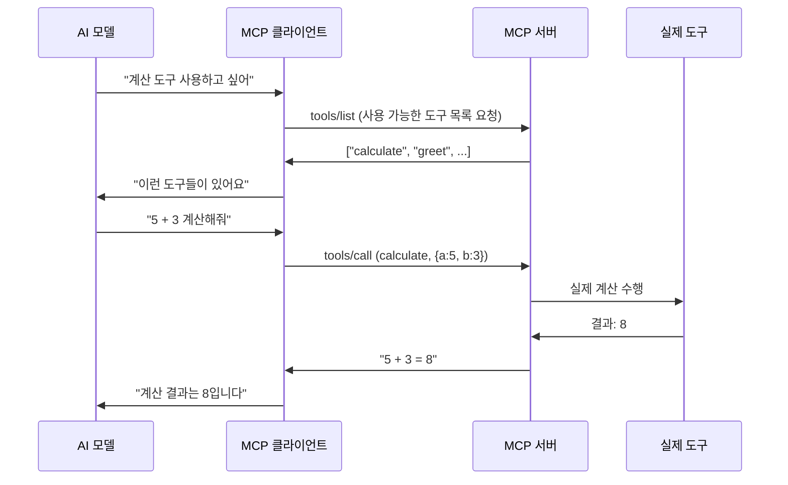

# 🎓 MCP 기본 개념 정리

## 🤔 MCP가 뭔가요?

**Model Context Protocol (MCP)**는 AI 모델이 다양한 도구와 안전하게 소통할 수 있게 해주는 "번역기" 같은 역할을 합니다.

### 🍕 피자 주문으로 이해하는 MCP

```
🧑‍💼 손님 (AI 모델)
   ↓ "피자 주문하고 싶어요"
🤖 점원 (MCP 클라이언트) 
   ↓ JSON-RPC로 주문 전달
🏪 피자집 (MCP 서버)
   ↓ 주방에서 피자 제작
🍕 완성된 피자 (실행 결과)
```

## 🏗️ MCP의 3가지 핵심 요소

### 1. 📋 **툴 (Tools)**
- AI가 사용할 수 있는 "기능들"
- 예: 계산하기, 파일 읽기, 이메일 보내기

### 2. 📚 **리소스 (Resources)** 
- AI가 참고할 수 있는 "정보들"
- 예: 문서, 데이터베이스, 웹페이지

### 3. 💬 **프롬프트 (Prompts)**
- AI에게 주는 "지시사항 템플릿"
- 예: "이 코드를 리뷰해줘", "이 글을 요약해줘"

## 🔄 MCP 동작 과정



## 💻 우리가 만든 첫 번째 MCP

### 서버에서 제공하는 툴들:
- `greet`: 친근한 인사 툴
- `calculate`: 사칙연산 계산기

### 테스트 결과:
```bash
✅ greet: 안녕하세요, 개발자님! 😊 MCP에서 인사드립니다!
✅ calculate: 10 + 5 = 15
✅ calculate: 7 * 3 = 21
```

## 🎯 다음에 배울 것들

1. **실제 서버-클라이언트 통신**: JSON-RPC를 통한 실시간 소통
2. **실용적인 툴 추가**: 파일 읽기, 웹 검색 등
3. **스마트 에이전트**: 여러 툴을 조합해서 복잡한 작업 수행

## 💡 핵심 포인트

- MCP는 **표준 규약**이라 다양한 도구들이 쉽게 연결됨
- **JSON-RPC 2.0**로 안전하고 신뢰성 있는 통신
- AI가 **스스로 도구를 선택하고 사용**할 수 있게 해줌

---
*MCP를 이해했다면, 이제 진짜 에이전트를 만들 준비가 된 것입니다! 🚀* 